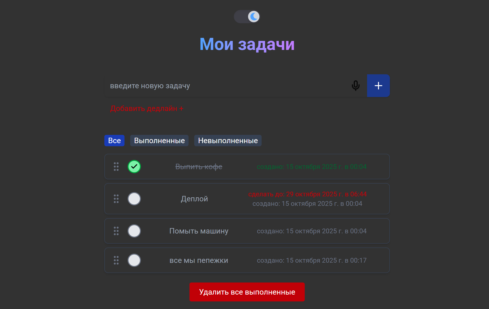

# React Advanced Todo

Расширенное приложение для управления задачами с поддержкой тем оформления, drag-and-drop, сетевым статусом и другими функциями.

<div align="center">


_Интерфейс_

</div>

## Быстрый запуск

https://alex-zander-0403.github.io/react-advanced-todo/

## Технологии

- React 19
- Vite
- Tailwind CSS
- DnD Kit (для drag-and-drop)
- React Icons
- Кастомные хуки и контексты

## Основные функции

✅ Темное/светлое оформление  
✅ Drag-and-drop для изменения порядка задач  
✅ Подтверждение удаления (одиночные/все выполненные)  
✅ Голосовой ввод задач - SpeechRecognition API
✅ Сетевой статус (онлайн/оффлайн)  
✅ localStorage для сохранения состояния  
✅ Адаптивный дизайн  
✅ Ленивая загрузка компонентов

## Структура проекта

```
src/
├── components/       # UI компоненты
├── contexts/         # React контексты
├── hooks/            # Кастомные хуки
├── providers/        # Провайдеры контекстов
├── helpers/          # Вспомогательные функции
├── api/              # API взаимодействие
└── assets/           # Статические ресурсы
```

## Кастомные хуки

Проект использует несколько кастомных хуков для управления состоянием и логикой:

- `useTodoManagement` - Главный хук, объединяющий всю логику управления состоянием
- `useLocalStorage` - Работа с локальным хранилищем (загрузка/сохранение задач)
- `useTodoApi` - API взаимодействие с бэкендом (CRUD операции)
- `useTodoHelpers` - Вспомогательные функции (сортировка, создание/обновление задач)
- `useTodoActions` - Основные действия с задачами (добавление, редактирование, удаление)

## Кастомный провайдер - NetworkProvider

Обеспечивает мониторинг сетевого статуса приложения:

- Автоматически определяет онлайн/оффлайн состояние
- Показывает системные уведомления при изменении сети
- Предоставляет контекст для доступа к сетевому статусу
- Интегрирован в корневой компонент приложения (App.jsx)
